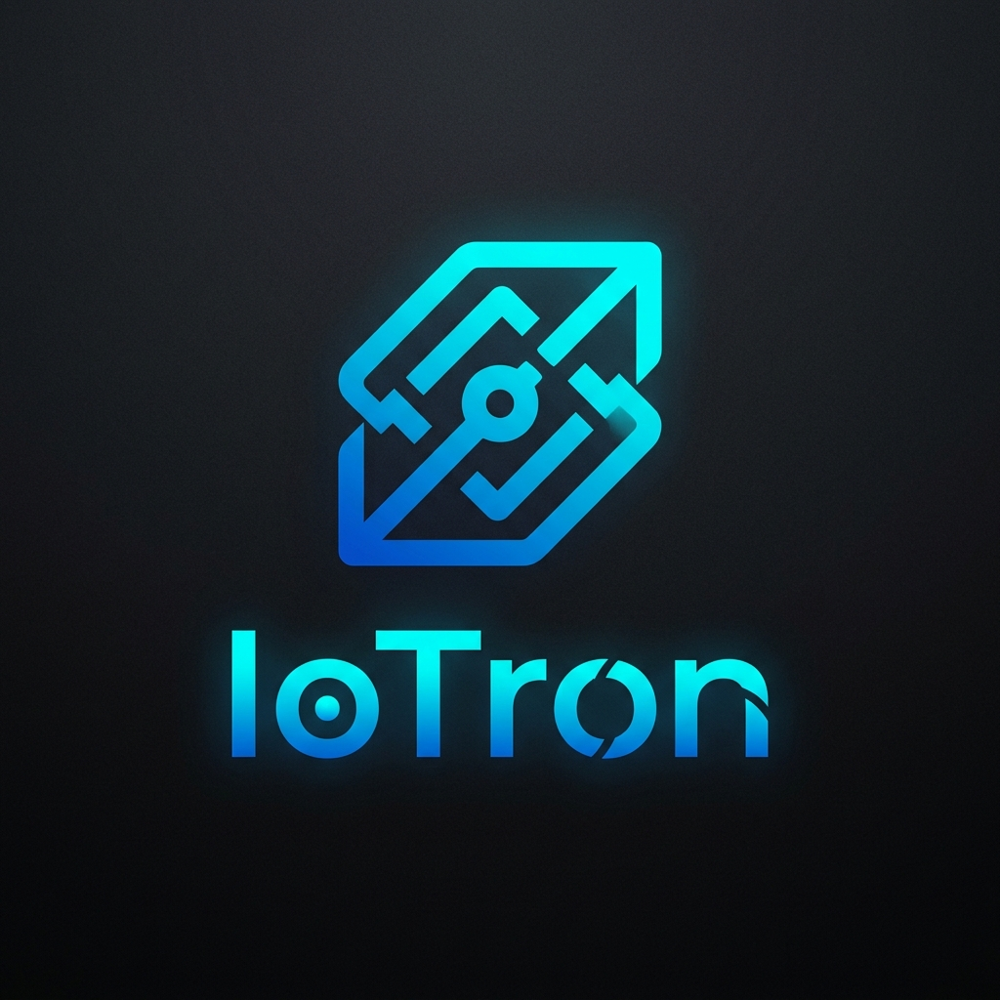

<p align="center">
  
</p>

# IoTron

IoTron is an open-source IoT framework for building device-to-cloud workflows across embedded boards and edge systems. The repository includes a Python control plane, a FastAPI backend, a browser operations console, production-oriented flashing and OTA workflows, a native runtime execution layer in `core/`, and Python/Go integration surfaces.


## Implemented Surfaces

- Python CLI for package, board, protocol, network, flash, OTA, and AI planning workflows
- FastAPI control plane with dashboard, catalog, device registry, telemetry ingestion, flashing, OTA, package, and planning endpoints
- Live protocol exchange adapters for HTTP, TCP, UDP, MQTT, WebSocket, serial, and I2C with optional runtime dependencies
- Static dashboard UI served from FastAPI at `/dashboard`
- Board toolchain integration with artifact validation, signed OTA rollout bundles, staged rollout metadata, rollback targets, and health-confirmation workflow support
- Native `core/` runtime layer with device lifecycle supervision, protocol sessions, network sessions, buffering, retry policy, storage descriptors, and a C ABI for shared-library builds
- Native Python and Go binding glue for compiled-library integration
- CI, release, and security workflows for GitHub Actions
- Operator/device bearer tokens, API key compatibility, OIDC external-token exchange, audit logging, rate limiting, CORS control, and security headers
- SQLite-backed persistence for packages, devices, telemetry, deployments, audit trails, tenancy, RBAC, revocations, notifications, and durable jobs

## Quick Start

```bash
pip install -r requirements.txt
python scripts/migrate_db.py
python -m iotron.cli status
python -m iotron.cli toolchains
python -m iotron.cli flash esp32 firmware.bin
python -m iotron.cli devices
python -m iotron.cli telemetry --limit 10
python scripts/build_native.py
uvicorn iotron.api:app --reload
```

Open:

- Dashboard: `http://127.0.0.1:8000/dashboard`
- API docs: `http://127.0.0.1:8000/docs`

## Storage Model

IoTron uses `vendor/iotron_state.db` as the active local backend. The database stores:

- packages
- devices
- telemetry
- deployments
- audit records
- tenants
- RBAC policies
- revoked tokens
- notification channels

Legacy files such as `vendor/installed_packages.db` and `vendor/runtime_state.json` are import-only compatibility sources for older installs. They are not the active persistence layer.

The vendor directory is documented in [vendor/README.md](vendor/README.md).

## CLI Commands

```text
status
boards [--family FAMILY]
protocols
networks
toolchains
devices
telemetry [--device-id DEVICE] [--limit N]
list
install PACKAGE [--version VERSION]
uninstall PACKAGE
update PACKAGE [--version VERSION]
select-board BOARD
enable-protocol PROTOCOL
enable-network NETWORK
web install
flash BOARD ARTIFACT [--port PORT] [--fqbn FQBN] [--execute]
ota BOARD ARTIFACT --host HOST [--username USER] [--destination PATH] [--execute]
build-native [--python PYTHON]
ai-plan --goal TEXT [--board BOARD]
export-config
```

## FastAPI Endpoints

- `GET /health`
- `GET /dashboard`
- `GET /dashboard/data`
- `GET /dashboard/summary`
- `GET /backend/overview`
- `GET /native/manifest`
- `POST /auth/token`
- `POST /auth/revoke`
- `POST /auth/exchange-external`
- `GET /security/metadata`
- `GET /identity/discovery`
- `GET /catalog/boards`
- `GET /catalog/protocols`
- `GET /catalog/networks`
- `GET /catalog/toolchains`
- `GET /protocols/capabilities`
- `POST /protocols/exchange`
- `GET /devices`
- `POST /devices/register`
- `POST /devices/heartbeat`
- `POST /devices/deployment-confirmation`
- `GET /telemetry`
- `POST /telemetry`
- `GET /deployments`
- `GET /audit`
- `GET /metrics`
- `GET /logs`
- `GET /traces`
- `GET /alerts`
- `POST /alerts/dispatch`
- `GET /jobs`
- `GET /jobs/{job_id}`
- `GET /workers/metadata`
- `POST /workers/claim`
- `POST /jobs/{job_id}/complete`
- `GET /backups`
- `POST /backups`
- `POST /backups/restore`
- `GET /dr/plan`
- `GET /tenants`
- `POST /tenants`
- `GET /rbac/policies`
- `POST /rbac/policies`
- `GET /notifications/channels`
- `POST /notifications/channels`
- `POST /project/flash`
- `POST /project/ota`
- `POST /project/prune`
- `POST /project/hardware-validate`
- `POST /project/select-board`
- `POST /project/enable-protocol`
- `POST /project/enable-network`
- `POST /project/web/install`
- `POST /packages/install`
- `POST /packages/uninstall`
- `POST /packages/update`
- `POST /ai/plan`

## Security and Operations

Environment settings live in [.env.example](.env.example):

- `IOTRON_API_KEY`: protects mutation endpoints when set
- `IOTRON_BEARER_SECRET`: signing secret for operator and device tokens
- `IOTRON_PREVIOUS_BEARER_SECRET`: previous signing secret used during token rotation
- `IOTRON_OIDC_ISSUER`: expected issuer for external identity integration
- `IOTRON_OIDC_AUDIENCE`: expected audience for external identity integration
- `IOTRON_OIDC_SHARED_SECRET`: HS256 verification secret for external-token exchange in local or controlled environments
- `IOTRON_OIDC_ROLE_CLAIM`: claim used to derive IoTron RBAC role
- `IOTRON_OIDC_TENANT_CLAIM`: claim used to derive tenant identity
- `IOTRON_OIDC_JWKS_URL`: external JWKS endpoint metadata hook
- `IOTRON_SECRET_FILE`: optional JSON secret file such as `vendor/secrets.json`
- `IOTRON_ALLOWED_ORIGINS`: allowed browser origins for the API
- `IOTRON_RATE_LIMIT_PER_MINUTE`: per-client request cap
- `IOTRON_TOKEN_TTL_SECONDS`: operator token lifetime
- `IOTRON_DEVICE_TOKEN_TTL_SECONDS`: device token lifetime
- `IOTRON_ARTIFACT_SIGNING_KEY`: signing key for deployment artifact manifests
- `IOTRON_NATIVE_LIB`: compiled native library path for Python binding use
- `IOTRON_WORKER_BACKEND`: `local`, `sqlite`, or `remote`
- `IOTRON_REMOTE_WORKER_URL`: remote worker coordinator URL when using external orchestration

CI and release automation live in `.github/workflows/`.

## Vendor Layout

```text
vendor/
  iotron_state.db
  backups/
  README.md
```

Optional legacy compatibility files may appear during migration, but the SQLite database is the authoritative store.

## Backend SDKs

- FastAPI is the primary backend API layer and now exposes operator auth, device registry, telemetry ingestion, deployment tracking, audit logs, backend overview, and runtime manifest endpoints.
- Protocol exchange endpoints expose live transport operations for supported adapters, with optional broker and bus dependencies loaded at runtime.
- Go support lives in [bindings/go/iotron.go](bindings/go/iotron.go) as a backend client for health checks, state, auth token issuance, deployments, toolchains, device registration, telemetry, flash, and OTA operations.
- Python native binding helpers live in [bindings/python/iotron.py](bindings/python/iotron.py) and can load a compiled shared library via `IOTRON_NATIVE_LIB`.

## Identity and Workers

IoTron now supports two identity paths:

- native bearer tokens signed by IoTron
- external bearer tokens exchanged through OIDC/IAM claim mapping

The external identity path currently supports HS256 verification through `IOTRON_OIDC_SHARED_SECRET`, issuer and audience validation, role claim mapping, and tenant claim mapping. Discovery integration is exposed through `/identity/discovery`.

Worker execution now supports:

- `local`: in-process thread executor
- `sqlite`: durable queued jobs stored in `vendor/iotron_state.db` and claimable by external workers
- `remote`: external coordinator mode using the same durable SQLite queue metadata plus remote endpoint configuration

Worker endpoints:

- `GET /workers/metadata`
- `POST /workers/claim`
- `POST /jobs/{job_id}/complete`

## Protocol I/O

The control plane can perform direct protocol exchanges through `/protocols/exchange` for:

- HTTP
- TCP
- UDP
- MQTT
- WebSocket
- serial
- I2C

HTTP, TCP, and UDP work with the current dependency set. MQTT, WebSocket, serial, and I2C require their respective client libraries and host access to the target broker or bus.

## OTA Signing

OTA plans now include a signed rollout bundle in addition to the artifact manifest. The bundle signs:

- artifact digest
- destination host and path
- rollout policy
- rollback artifact reference
- rollout channel

Execution verifies both the artifact manifest and the rollout bundle before dispatch.

## Native Runtime

The `core/` directory now exports a runtime model for:

- board/device descriptors and lifecycle supervision
- embedded protocol session descriptors
- network transport session descriptors
- runtime buffering and retry policy models
- SQLite storage schema and journaling helpers
- C ABI entry points in `core/c_api.h` and `core/c_api.cpp`

Native builds:

- `CMakeLists.txt` provides a shared-library build target for environments with CMake and a C++ compiler.
- `scripts/build_native.py` provides a direct build path for `g++`, `clang++`, or MSVC `cl`.

The native runtime, shared-library interfaces, and board integration workflow are built around the backend control plane and SQLite vendor store. Hardware validation and vendor-tool execution still depend on the toolchains and devices installed in the target environment.

## Roadmap

The next areas of expansion for the framework are:

- actual hardware flashing execution in CI with board-specific integration tests and connected devices
- end-to-end protocol I/O against real buses and brokers, beyond lifecycle/session supervision
- signed OTA rollout workflow and artifact verification
- richer identity integration such as RBAC backed by OIDC or external IAM
- deeper live integration with external IdPs and distributed worker infrastructure
